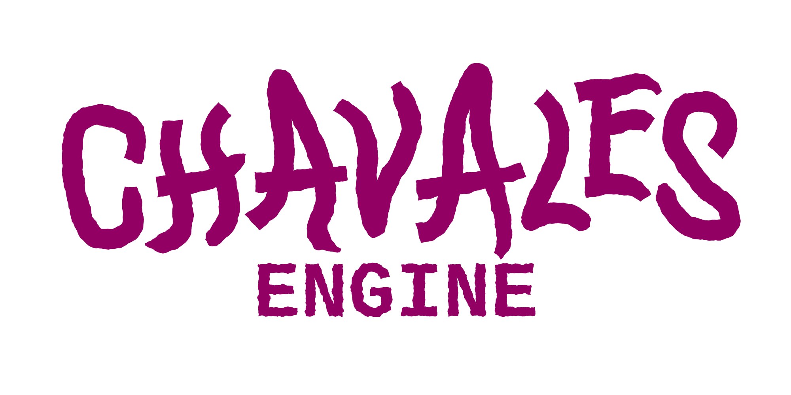

# ChavalesEngine

  
  <h3>Motor de videojuegos desarrollado para Proyectos 3</h3>
  
<i>Grado en Desarrollo de Videojuegos - Universidad Complutense de Madrid (UCM)</i>

---

## Equipo de Desarrollo

<table style="width:100%; border:none;">
  <tr>
	<td>• Nieves Alonso Gilsanz</td>
	<td>• Andrés García Navarro</td>
  </tr>
  <tr>
	<td>• Javier Gómez Zúñiga</td>
	<td>• Pablo Iglesias Rodrigo</td>
  </tr>
  <tr>
	<td>• Sergio Naranjo Barroso</td>
	<td>• Ismael Ortega Sánchez</td>
  </tr>
  <tr>
	<td>• Iván Palomino Rodríguez</td>
	<td>• Jule Page Galocha</td>
  </tr>
  <tr>
	<td>• Daniel Ramos Sánchez-Manjavacas</td>
	<td>• Cynthia Tristán Álvarez</td>
  </tr>
</table>

---

## Arquitectura del Motor
El motor está diseñado siguiendo una arquitectura modular para facilitar la extensibilidad y el rendimiento.

### Módulos
La base del motor se divide en los siguientes bloques fundamentales:

| Módulo | Descripción |
| :--- | :--- |
| **Core** | Definición de clases básicas y utilidades |
| **Plataforma** | Abstracción de ventana, entrada (input) y eventos del sistema. |
| **Render** | Pipeline gráfico optimizado y gestión de materiales. |
| **Físicas** | Integración de colisiones y dinámicas de cuerpos. |
| **Recursos** | Carga y gestión de assets (texturas, modelos, scripts). |
| **Audio** | Sistema de sonido espacial y gestión de pistas. |

### Engine
* **GameLoader:** Sistema de carga dinámica de escenas.
* **StateMachine:** Control del flujo de estados del juego.
* **ComponentDLLoader:** Carga de lógica de juego y plugins mediante bibliotecas dinámicas (DLLs).
* **ComponentRegistry:** Registro de componentes dinamico, actualizado con cada carga de DLL.
* **Tools:** Conjunto de utilidades para el desarrollo y depuración.

### Cómo crear un juego con ChavalesEngine
Hay un .zip en el repositorio en el que se encuentran todos los .bats necesarios para crear la estructura de un juego usando el motor.

Contiene:
<table>
  <thead>
    <tr>
      <th>Script</th>
      <th>Descripción</th>
    </tr>
  </thead>
  <tbody>
    <tr>
      <td>update_engine.bat</td>
      <td>Actualiza y sincroniza el motor con el proyecto. También puede compilarlo y copiar las librerías, cabeceras y DLLs necesarias al proyecto.</td>
    </tr>
    <tr>
      <td>build_game.bat</td>
      <td>Compila la DLL del juego. Por defecto compila en Release. Puedes pasarle Debug como parámetro (build_game.bat Debug). Hace un .exe del juego.</td>
    </tr>
    <tr>
      <td>new_component.bat</td>
      <td>Genera un componente C++.</td>
    </tr>
    <tr>
      <td>new_scene.bat</td>
      <td>Genera una escena Lua.</td>
    </tr>
    <tr>
      <td>generate_project_files.ps1</td>
      <td>Regenera los archivos de proyecto necesarios para Visual Studio/CMake.</td>
    </tr>
    <tr>
      <td>new_project_configuration.bat</td>
      <td>Script interno utilizado durante la creación de proyectos.</td>
    </tr>
  </tbody>
</table>

#### Orden de creación:

1. new_project.bat MiJuego
2. cd MiJuego
3. update_engine.bat MiJuego

Una vez hecho esto, ya está listo para poder abrir la carpeta MiJego desde cualquier herramienta de desarrollo.

